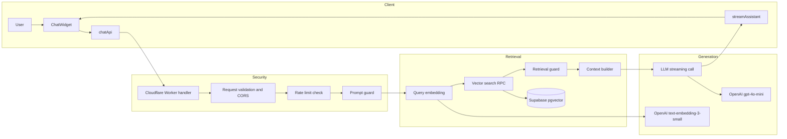
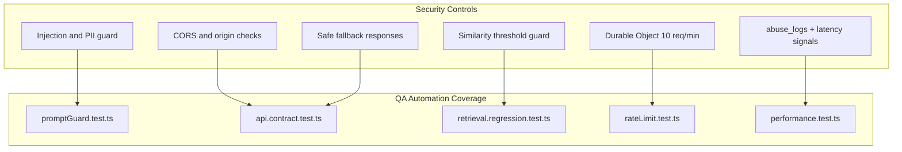
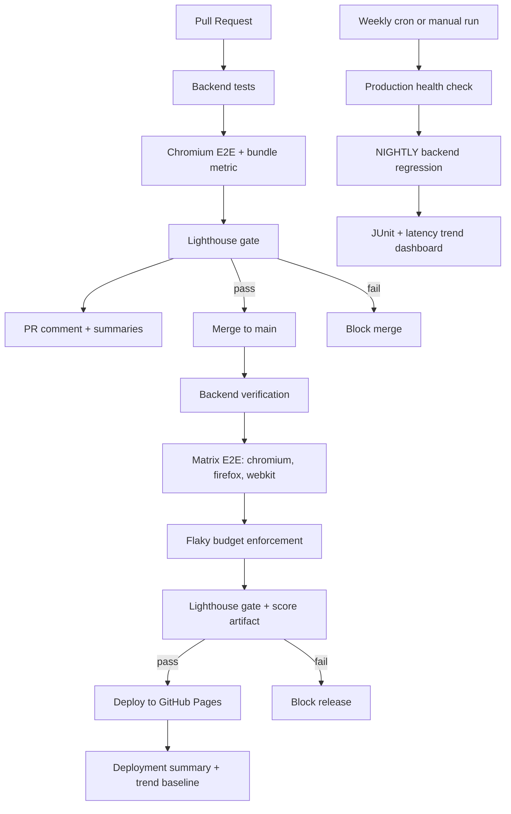
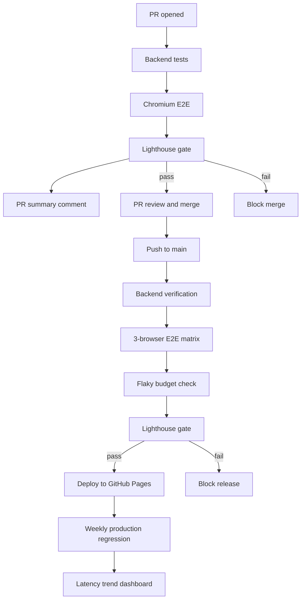

# David Abril — QA Automation Engineer / SDET Interactive RAG Portfolio

[](https://github.com/David101111101/PortfolioReactAppRepo/actions/workflows/weekly-regression-gates.yml)
[](https://github.com/David101111101/PortfolioReactAppRepo/actions/workflows/pr-quality-gates.yml) 
[](https://github.com/David101111101/PortfolioReactAppRepo/actions/workflows/deploy.yml)
[](https://github.com/David101111101/PortfolioReactAppRepo/actions/workflows/lint-quality-gate.yml)


This project focuses on building a production-ready QA automation strategy for RAG chatbot reliability, prompt-safety validation, and regression monitoring.

https://www.daveautomation.dev/


## Quality assurance built-in

- **Automated E2E tests** — Backend validation, Chromium PR checks, and multi-browser release verification
- **Cross-browser validation** — Chromium on PRs, full matrix before deployment (Chromium, Firefox, WebKit)
- **Accessibility audits** — axe-core integration ensures WCAG compliance
- **Performance budgets** — Lighthouse CI prevents regressions
- **Quality telemetry** — Bundle size, flaky-test budget, Lighthouse score, and latency trends tracked in CI
- **Instant debugging** — Traces, screenshots, videos, and workflow summaries generated on failure

---

## AI Testing Architecture Diagrams

These are the most important Mermaid diagrams from the docs folder, included here to show how I am adapting classic QA automation to modern AI testing techniques.

Reference docs:
- [docs/architecture.md](docs/architecture.md)
- [docs/security-architecture.md](docs/security-architecture.md)
- [docs/qa-strategy-architecture.md](docs/qa-strategy-architecture.md)

### 1) RAG Chatbot Architecture (Client → Security → Retrieval → Generation)



### 2) Security Layers + QA Validation Mapping



### 3) Multi-Layer Quality Gates



---

## 🚀 PR Quality Gates: Playwright E2E + GitHub Actions

This portfolio itself demonstrates production-grade automation practices. Every pull request is validated through an integrated Playwright E2E framework before merging to `main`.

### What's automated

| Feature | Benefit |
|---------|---------|
| **Fixtures + Page Object Model (POM)** | Maintainable, scalable test architecture that reduces friction as tests grow |
| **Tiered browser execution** | Fast Chromium feedback on PRs, then full browser matrix before release |
| **Accessibility checks** | axe-core integration validates WCAG compliance in every PR |
| **Performance budgets** | Lighthouse CI enforces performance thresholds—no regressions slip through |
| **Flaky budget enforcement** | Release pipeline fails when flaky behavior crosses an explicit threshold |
| **CI telemetry artifacts** | Bundle size, E2E pass/fail, duration, Lighthouse, and latency metrics are retained for trend analysis |
| **Debug artifacts** | Traces, screenshots, and videos auto-retained on failure for instant root-cause analysis |
| **JUnit in Checks UI** | Test results appear in GitHub's native Checks panel—no downloads needed |
| **Automated PR comments** | github-actions[bot] posts a summary per run so reviewers get instant signal |

### Why it matters

✅ **PR gates reduce regressions** — main stays deployable  
✅ **Debug artifacts make failures actionable** — not just "red/green"  
✅ **Fast, readable CI feedback** — developers iterate with confidence  


Tests validate:
- ✅ Smoke (page loads, critical paths work)
- ✅ Navigation (header, routing, external links)
- ✅ Accessibility (axe-core: WCAG compliance)
- ✅ Resume download functionality

## CI/CD Testing Strategy

This repo demonstrates a **production-grade testing pipeline** where quality checks happen at every stage—both before and after merging to main.

### The Complete Flow



### CI Behavior: PR Quality Gates

**Trigger:** Every pull request to `main`

**What runs:**
- ✅ **Backend validation** — Root + chatbot dependencies install, Worker boots locally, and backend unit/contract tests run first
- ✅ **Chromium-only E2E** — Frontend builds and Playwright runs the Chromium project for fast PR feedback:
  - Page loads and critical paths work
  - Navigation between sections
  - Resume download functionality
- ✅ **Metrics capture** — Bundle size, E2E result, accessibility metric, and duration are uploaded as artifacts
- ✅ **Lighthouse gate** — Runs after Chromium E2E passes, enforcing performance, accessibility, best-practices, and SEO thresholds
- ✅ **Visual reports** — JUnit results appear in GitHub Checks UI
- ✅ **Automated PR summary** — The workflow downloads summaries/metrics and refreshes a single bot comment with the gate results and debugging path

**Outcome:**
- 🚫 **Fails?** PR blocks merge. Reviewer sees instant feedback.
- ✅ **Passes?** Green checkmark appears. PR is safe to merge.

Workflow: [.github/workflows/pr-quality-gates.yml](.github/workflows/pr-quality-gates.yml)

### CD Behavior: Deploy with Verification

**Trigger:** Push to `main` (after PR merge) or manual workflow dispatch

**Quality gates before deployment:**
1. **Backend verification** — Worker starts and backend `test:ci` suite runs
2. **E2E browser matrix** — Playwright runs on Chromium, Firefox, and WebKit with per-browser summaries
3. **Flaky budget enforcement** — The release fails if flaky counts exceed the configured threshold
4. **Lighthouse audit** — Runs after the E2E matrix completes and stores a reusable score artifact
5. **Deploy** — GitHub Pages deployment only happens after all verification gates pass
6. **Release summary** — Deployment writes environment details and keeps Lighthouse score data for future trend comparison

**Deployment only happens if:**
- ✅ Backend tests pass
- ✅ Multi-browser E2E and flaky budget checks pass
- ✅ Lighthouse budgets pass

**Workflow:** [.github/workflows/deploy.yml](.github/workflows/deploy.yml)

### Weekly Production Regression

**Trigger:** Every Wednesday at `01:00 UTC` or manual workflow dispatch

**What runs:**
- ✅ **Production endpoint validation** — `API_BASE_URL` must be present and `/health` must respond before tests start
- ✅ **Nightly regression mode** — Backend `test:ci` runs against the deployed API with `NIGHTLY=true`
- ✅ **JUnit publishing** — Regression results are surfaced in GitHub Checks
- ✅ **Latency trend tracking** — The current latency metric is compared against the previous weekly run and added to the dashboard summary

**Outcome:**
- 🚫 **Fails?** Production drift or regression is visible in the weekly dashboard and artifacts.
- ✅ **Passes?** The workflow records a fresh confidence signal for retrieval, contracts, rate limiting, and latency.

### Why Two Test Stages?

| Stage | Scope | Speed | Cost |
|-------|-------|-------|------|
| **PR Quality Gates (CI)** | Fast feedback: backend + Chromium E2E + metrics + Lighthouse + PR comment | Faster | Protects merge quality |
| **Deploy Verification (CD)** | Comprehensive: backend + 3-browser matrix + flaky budget + Lighthouse + Pages deploy | Slower | Final release confidence |
| **Weekly Regression** | Production endpoint health, NIGHTLY backend regression, JUnit, and latency trending | Slowest | Detects post-release drift |

This balances **thoroughness** (catch issues in PR) with **speed** (fast deployment feedback).

---

## Debugging Test Failures

### In a PR (CI Failure)

1. **Check the PR comments** — github-actions[bot] posts a summary showing:
   - Which tests failed
   - Flaky test counts
   - Link to artifacts

2. **View Checks tab:**
   ```
   PR → Checks tab → failing job → "Details"
   ```

3. **Download artifacts:**
   ```
   PR → Checks → failing job → "Artifacts" section
   ↓
   playwright-{browser}.zip
   ```

4. **Debug traces locally:**
   ```bash
   unzip playwright-chromium.zip
   npx playwright show-trace playwright-report/trace.zip
   ```

### In Deploy (CD Failure)

1. **Check workflow run:**
   ```
   Repo → Actions → "Deploy static content to Pages" → latest run
   ```

2. **Open the failing gate job** (backend, e2e matrix browser, or lighthouse)

3. **Download artifacts:**
   ```
   Artifacts section → playwright-chromium / playwright-firefox / playwright-webkit
   ```

4. **Extract and inspect:**
   ```bash
   unzip playwright-chromium.zip
   # View HTML report
   open playwright-report/index.html
   
   # Deep dive: replay trace
   npx playwright show-trace trace.zip
   ```

### What Each Artifact Contains

| Artifact | Contains | Use Case |
|----------|----------|----------|
| `playwright-report/` | HTML test report with stats | Overview of pass/fail |
| `test-results/` | Per-test folders with screenshots/videos | Visual debugging |
| `trace.zip` | Playwright trace file | Replay test execution step-by-step |

---

### Local validation before pushing

Catch issues **before** you open a PR:

```bash
npm run build          # Catch build errors early
npm run test:e2e       # Run full test suite locally
npm run lint           # Check code quality
```

This complements CI checks and helps catch issues early before pushing.

---

## Deployment

This repo is designed to be CI/CD friendly with automated PR quality gates and release pipelines.

Workflows:
- 🔒 **[PR Quality Gates](.github/workflows/pr-quality-gates.yml)** — Backend-first PR validation with Chromium E2E, metrics capture, Lighthouse, and auto-updated PR summaries
- 🚀 **[Deploy with Verification](.github/workflows/deploy.yml)** — Backend verification, 3-browser E2E, flaky-budget enforcement, Lighthouse, and gated GitHub Pages release
- 🧪 **[Weekly Regression Suite](.github/workflows/weekly-regression-gates.yml)** — Scheduled production health checks, NIGHTLY regression tests, and latency-trend reporting


## Contact

- Email davidstevenabril@gmail.com