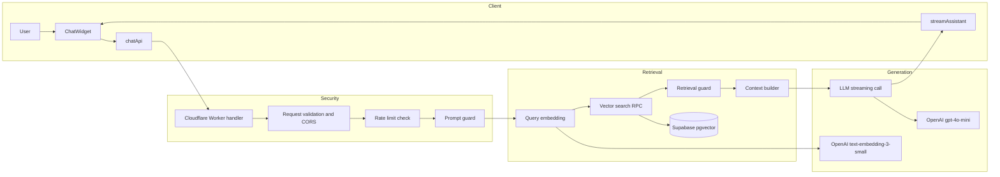
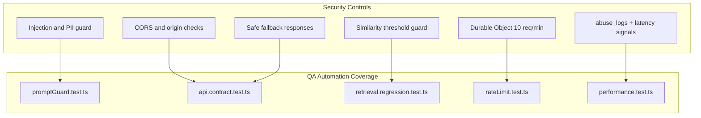
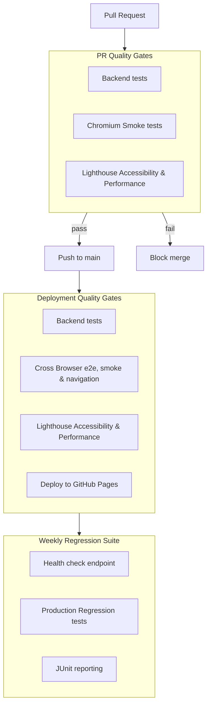
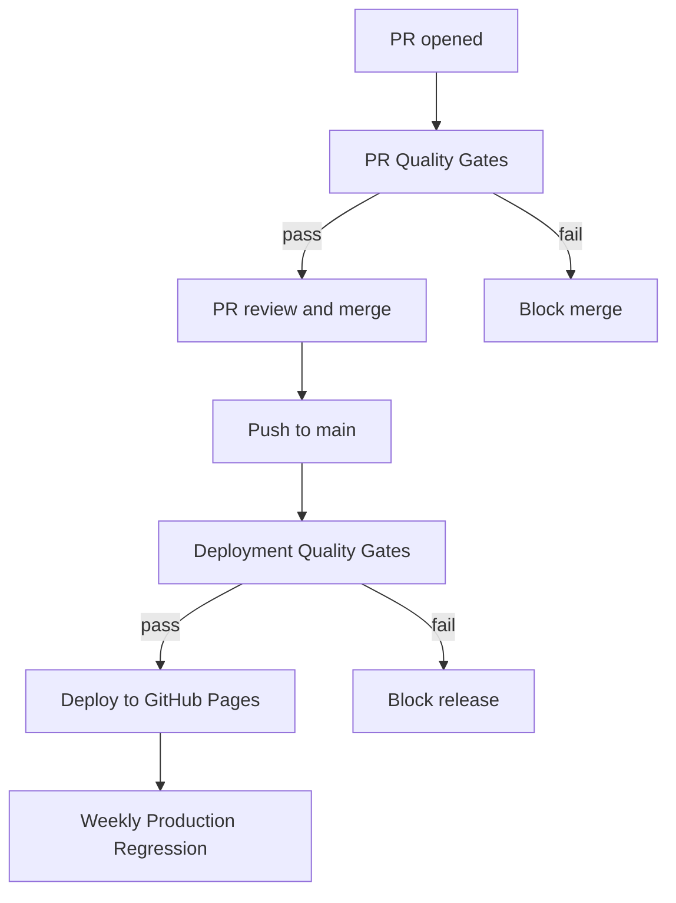

# David Abril — QA Automation Engineer / SDET Interactive RAG AI Portfolio

[](https://github.com/David101111101/PortfolioReactAppRepo/actions/workflows/weekly-regression-gates.yml)
[](https://github.com/David101111101/PortfolioReactAppRepo/actions/workflows/pr-quality-gates.yml) 
[](https://github.com/David101111101/PortfolioReactAppRepo/actions/workflows/deploy.yml)


This project focuses on building a production-ready QA automation strategy for AI systems, with emphasis on RAG reliability, prompt-safety validation, and regression monitoring.

https://www.daveautomation.dev/

## About me

**David Abril** — (English C2 Certified)  
QA Automation Engineer with backend development foundations and  
experience designing scalable test automation frameworks, 
CI/CD-integrated pipelines, and secure validation systems.


### Quality assurance built-in

- **Automated E2E tests** — Smoke, navigation, accessibility & performance checks on every PR
- **Cross-browser validation** — Full matrix runs before deployment (Chromium, Firefox, WebKit)
- **Accessibility audits** — axe-core integration ensures WCAG compliance
- **Performance budgets** — Lighthouse CI prevents regressions
- **Instant debugging** — Traces, screenshots, videos generated on failure

---

## AI Testing Architecture Diagrams

These are the most important Mermaid diagrams from the docs folder, included here to show how I am adapting classic QA automation to modern AI testing techniques.

Reference docs:
- [docs/architecture.md](docs/architecture.md)
- [docs/security-architecture.md](docs/security-architecture.md)
- [docs/qa-strategy-architecture.md](docs/qa-strategy-architecture.md)

### 1) RAG Chatbot Architecture (Client → Security → Retrieval → Generation)



### 2) Security Layers + QA Validation Mapping



### 3) Multi-Layer Quality Gates



---

## 🚀 PR Quality Gates: Playwright E2E + GitHub Actions

This portfolio itself demonstrates production-grade automation practices. Every pull request is validated through an integrated Playwright E2E framework before merging to `main`.

### What's automated

| Feature | Benefit |
|---------|---------|
| **Fixtures + Page Object Model (POM)** | Maintainable, scalable test architecture that reduces friction as tests grow |
| **Cross-browser execution** | Full browser matrix before deployment catches engine-specific regressions |
| **Accessibility checks** | axe-core integration validates WCAG compliance in every PR |
| **Performance budgets** | Lighthouse CI enforces performance thresholds—no regressions slip through |
| **Debug artifacts** | Traces, screenshots, and videos auto-retained on failure for instant root-cause analysis |
| **JUnit in Checks UI** | Test results appear in GitHub's native Checks panel—no downloads needed |
| **Automated PR comments** | github-actions[bot] posts a summary per run so reviewers get instant signal |

### Why it matters

✅ **PR gates reduce regressions** — main stays deployable  
✅ **Debug artifacts make failures actionable** — not just "red/green"  
✅ **Fast, readable CI feedback** — developers iterate with confidence  


Tests validate:
- ✅ Smoke (page loads, critical paths work)
- ✅ Navigation (header, routing, external links)
- ✅ Accessibility (axe-core: WCAG compliance)
- ✅ Resume download functionality


## Repo structure

```
src/
├── components/         # UI: Header, ProjectCard, DiplomaGrid, Section, etc.
├── data/               # Portfolio meta: projects, skills, experiences, diplomas
├── styles/             # Global theme & CSS
├── App.tsx             # Root component
└── main.tsx            # Entry point

e2e/
├── fixtures/           # Playwright test fixtures & configuration
├── pages/              # Page Object Models (HomePage, etc.)
└── specs/              # E2E test suites (smoke, navigation, accessibility, resume)

.github/workflows/
├── pr-quality-gates.yml        # PR validation: backend + chromium E2E + Lighthouse
├── deploy.yml                  # Main deploy gate: backend + multi-browser E2E + Lighthouse + Pages deploy
└── weekly-regression-gates.yml # Weekly scheduled production regression suite

public/
├── diplomas/           # Certification images
└── other assets
```

## CI/CD Testing Strategy

This repo demonstrates a **production-grade testing pipeline** where quality checks happen at every stage—both before and after merging to main.

### The Complete Flow



### CI Behavior: PR Quality Gates

**Trigger:** Every pull request to `main`

**What runs:**
- ✅ **Backend validation** — Unit/contract-oriented backend tests
- ✅ **E2E tests** — Chromium project run for fast PR feedback:
  - Page loads and critical paths work
  - Navigation between sections
  - Resume download functionality
  
- ✅ **Accessibility Audits** — axe-core checks for WCAG compliance
  
- ✅ **Performance Budgets** — Lighthouse CI enforces performance thresholds
  
- ✅ **Visual Reports** — JUnit test results appear in GitHub Checks UI

- ✅ **Automated Summary** — PR comment posted by github-actions[bot] with:
  - Test counts (passed, failed, flaky)
  - Top failures (if any)
  - Links to artifacts and debugging info

**Outcome:**
- 🚫 **Fails?** PR blocks merge. Reviewer sees instant feedback.
- ✅ **Passes?** Green checkmark appears. PR is safe to merge.

Workflow: [.github/workflows/pr-quality-gates.yml](.github/workflows/pr-quality-gates.yml)

### CD Behavior: Deploy with Verification

**Trigger:** Push to `main` (after PR merge) or manual workflow dispatch

**Quality gates before deployment:**
1. **Backend tests** — Worker starts and backend suite runs
2. **E2E Browser Matrix** — Playwright runs on Chromium, Firefox, and WebKit
3. **Lighthouse Audit** — Performance and accessibility thresholds enforced
4. **Deploy** — GitHub Pages deployment only after all gates pass

**Deployment only happens if:**
- ✅ Backend tests pass
- ✅ Multi-browser E2E passes
- ✅ Lighthouse budgets pass

**Workflow:** [.github/workflows/deploy.yml](.github/workflows/deploy.yml)

### Why Two Test Stages?

| Stage | Scope | Speed | Cost |
|-------|-------|-------|------|
| **PR Quality Gates (CI)** | Fast feedback: backend + chromium E2E + Lighthouse | Faster | Protects merge quality |
| **Deploy Verification (CD)** | Comprehensive: backend + 3-browser matrix + Lighthouse | Slower | Final release confidence |

This balances **thoroughness** (catch issues in PR) with **speed** (fast deployment feedback).

---

## Debugging Test Failures

### In a PR (CI Failure)

1. **Check the PR comments** — github-actions[bot] posts a summary showing:
   - Which tests failed
   - Flaky test counts
   - Link to artifacts

2. **View Checks tab:**
   ```
   PR → Checks tab → failing job → "Details"
   ```

3. **Download artifacts:**
   ```
   PR → Checks → failing job → "Artifacts" section
   ↓
   playwright-{browser}.zip
   ```

4. **Debug traces locally:**
   ```bash
   unzip playwright-chromium.zip
   npx playwright show-trace playwright-report/trace.zip
   ```

### In Deploy (CD Failure)

1. **Check workflow run:**
   ```
   Repo → Actions → "Deploy static content to Pages" → latest run
   ```

2. **Open the failing gate job** (backend, e2e matrix browser, or lighthouse)

3. **Download artifacts:**
   ```
   Artifacts section → playwright-chromium / playwright-firefox / playwright-webkit
   ```

4. **Extract and inspect:**
   ```bash
   unzip playwright-chromium.zip
   # View HTML report
   open playwright-report/index.html
   
   # Deep dive: replay trace
   npx playwright show-trace trace.zip
   ```

### What Each Artifact Contains

| Artifact | Contains | Use Case |
|----------|----------|----------|
| `playwright-report/` | HTML test report with stats | Overview of pass/fail |
| `test-results/` | Per-test folders with screenshots/videos | Visual debugging |
| `trace.zip` | Playwright trace file | Replay test execution step-by-step |

---

### Local validation before pushing

Catch issues **before** you open a PR:

```bash
npm run build          # Catch build errors early
npm run test:e2e       # Run full test suite locally
npm run lint           # Check code quality
```

This complements CI checks and helps catch issues early before pushing.

---

## Deployment

This repo is designed to be CI/CD friendly with automated PR quality gates and release pipelines.

Workflows:
- 🔒 **[PR Quality Gates](.github/workflows/pr-quality-gates.yml)** — Validates every PR before merge
- 🚀 **[Deploy with Verification](.github/workflows/deploy.yml)** — Backend + multi-browser E2E + Lighthouse before going live
- 🧪 **[Weekly Regression Suite](.github/workflows/weekly-regression-gates.yml)** — Scheduled production-endpoint regression checks


## Contact

- Email davidstevenabril@gmail.com