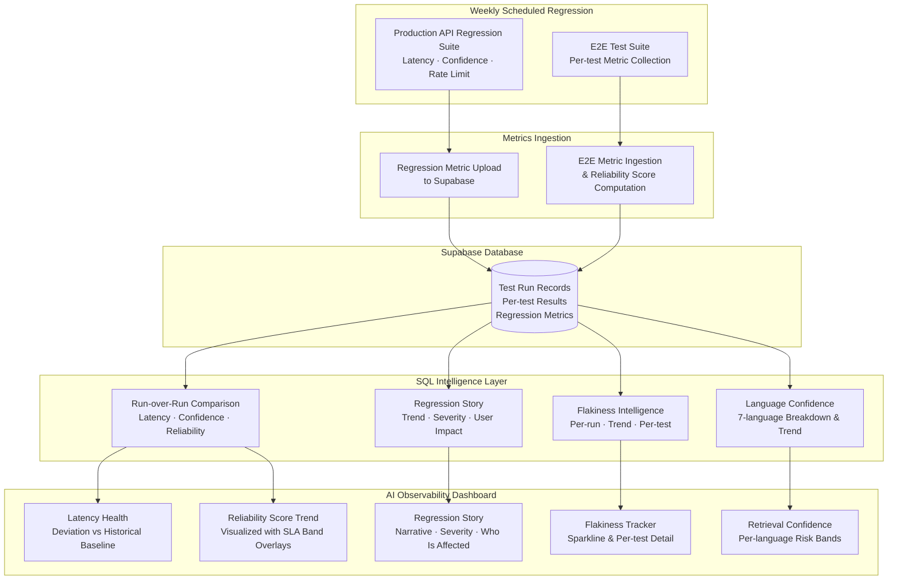
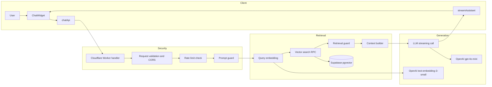
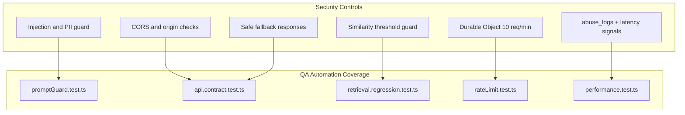
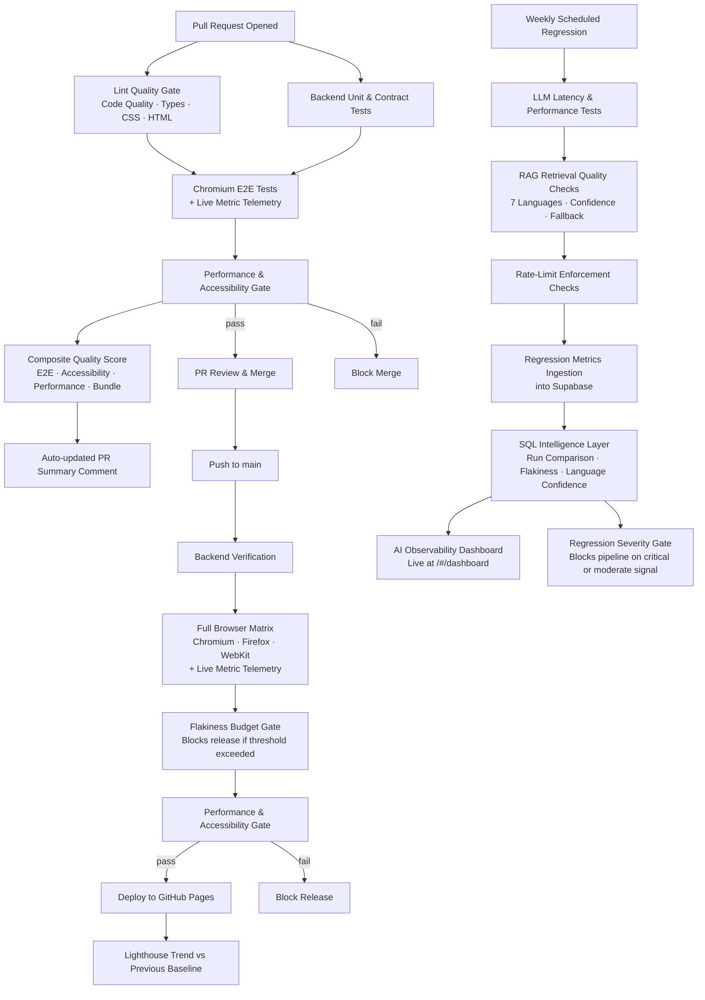

# AI Quality Intelligence Platform For R.A.G. Systems

**Live site:** https://www.daveautomation.dev/ &nbsp;|&nbsp; **AI Dashboard:** https://www.daveautomation.dev/#/dashboard

---

This system detects AI behavioral regressions in production, surfaces them in a live observability dashboard, enforces production SLA compliance across five quality dimensions, and gates every release on measurable quality signals automatically, every week.

It is a production-grade AI Quality Intelligence Platform for RAG (Retrieval-Augmented Generation) systems. Traditional pass/fail testing is not enough for AI: confidence drops instead of crashes, answers degrade instead of erroring, and quality drifts over time across languages. This platform addresses all three.

## How to Navigate This Project

If you're a recruiter → start with **Real-World Impact** and **Skills & Engineering Depth**

If you're an engineer → jump to **Architecture** and **CI/CD Testing Strategy**

If you're interested in AI testing → focus on **Signal-Based Quality Assessment** and **AI Observability Dashboard**

---

## The Problem AI Teams Face

AI systems fail in ways that traditional QA cannot catch:

- **Probabilistic:** confidence drops instead of hard failures
- **Silent:** bad answers instead of crashes or 5xx errors
- **Gradual:** retrieval quality and latency drift across deploys
- **Multilingual:** degradation hits some languages before others

Standard test suites return green while the system is quietly serving worse answers to real users.

## The Solution

This platform implements a multi-signal regression intelligence system that:

- tracks retrieval confidence across 7 languages per weekly run
- monitors P95 latency and flags deviations vs a calibrated baseline
- detects statistical anomalies using z-score analysis
- enforces flakiness budgets to keep test reliability measurable
- computes a weighted reliability score per run
- enforces production SLA compliance across five quality dimensions (latency, confidence, min confidence, rate enforcement, degradation)
- ingests all signals into Supabase and exposes them through a live React dashboard

The decision layer distills all signals into one question:

> Is the system healthy, why not, and who is impacted?

---

## What Makes This Different

### 1. Signal-Based Quality Assessment
- Retrieval confidence scores instead of binary-only assertions
- Worst-case detection (`min_confidence`) to surface real user risk, not just averages — enforced as a dedicated SLA gate
- Rate-limit enforcement correctness tracked as a measurable percentage
- Five-gate production SLA compliance audit per weekly run (P95 latency, avg confidence, min confidence, rate enforcement, concurrency degradation)

### 2. Trend Detection Instead Of Single-Run Judgement
- Regression deltas vs previous runs via `regression_run_comparison` Supabase view
- Historical baselines derived from real production data
- Anomaly detection using standard deviation (z-score)

### 3. User-Impact Visibility
- Multilingual retrieval monitoring: English, Spanish, French, German, Portuguese, Chinese, Japanese
- Identification of which language degraded and by how much
- Worst-case experience surfaced directly in the dashboard, not buried in logs

### 4. Test Reliability As A First-Class Signal
- Flakiness tracked per test and per run via `test_flakiness_enriched` view
- Flaky-budget enforcement blocks releases when the threshold is crossed
- Reduced false confidence from unstable tests: reliability score = pass_rate × 0.7 + (1 − flaky_rate) × 0.2 + all_passed bonus × 0.1

---

## AI Observability Dashboard

The platform includes a live React dashboard at `/#/dashboard` built with Recharts and backed by Supabase SQL analytics views. It renders real production metrics after every weekly regression run, no manual report generation required.

## Self-Aware AI Chatbot — Dashboard Integration

The chatbot is now integrated with the historical observability dashboard. When a user selects a run on the Dashboard page, the chatbot automatically receives a structured **run snapshot** — including current metrics, the previous run for comparison, and pre-computed deltas — and switches into analysis mode.

This means the chatbot can reason about **its own production metrics in real time**.

### Two Operating Modes

| Mode | Trigger | Behavior |
|------|---------|----------|
| **Mode 1 — General (Home Page)** | No run data in context | Explains system architecture, metric formulas, debugging playbooks, and engineering decisions |
| **Mode 2 — Analysis (Dashboard Page)** | Run snapshot injected by the dashboard | Analyzes actual metric values, compares current vs previous run, identifies root causes, suggests investigation steps |

### Run Snapshot Context

When a run is selected on the Dashboard, the following signals are injected into the chatbot context:

- `P95 Latency` — current + previous + delta
- `Reliability Score` — current + previous + delta
- `Avg Confidence / Min Confidence` — current + previous + delta
- `Enforcement Rate` — current + previous + delta
- `Avg Rank Shift` — current + previous + delta

The chatbot uses this structured context to apply correlation rules, identify which signal changed most, and produce actionable debugging guidance grounded in real run data.

### Key Insight

This creates a closed loop: the same system that runs weekly regression tests and populates the dashboard also powers the chatbot that explains those results. The chatbot is not a standalone assistant — it is part of the observability platform.

---

## 🧠 AI Debugging Intelligence Layer

This project goes beyond monitoring and introduces an **AI-powered debugging intelligence layer** on top of the observability system.

The goal is not just to detect regressions, but to explain them.

---

### ❗ Problem

Traditional dashboards answer:

→ *What changed?*

But engineers need to know:

- Why did reliability drop?
- Is this latency spike meaningful?
- Which metric caused the regression?
- What should I investigate next?

Without this layer, engineers must manually correlate metrics, interpret trends, and infer root causes.

---

### ✅ Solution

This system introduces a structured reasoning layer composed of:

- **Metric Formulas** → how each signal is computed  
- **Debugging Playbook** → how to investigate issues  
- **Correlation Rules** → how metrics relate and influence each other  

Together, they enable the system to transform raw data into **actionable explanations**.

---

### ⚙️ How It Works

1. Metrics are computed and stored (latency, confidence, reliability, etc.)
2. Baselines are derived from historical data
3. Deviations are detected (baseline vs actual)
4. Correlation rules analyze relationships between signals
5. Debugging playbooks map patterns → root causes → actions

---

### 🔍 Example

Instead of showing:

> Reliability: 89 (-2%)

The system explains:

> Reliability decreased due to increased latency (+8%) and confidence drop (-4%).  
> Likely cause: backend performance degradation affecting retrieval quality.  
> Recommended action: inspect API latency and retrieved context.

---

### 🚀 Impact

This transforms the system from:

→ **Observability (what happened)**  

into:

→ **Debugging Intelligence (why it happened and what to do next)**  

---

### 🧠 Engineering Significance

This layer reflects a shift from:

- test automation → decision systems  
- metrics → reasoning  
- dashboards → engineering intelligence  

It aligns with the goal of building systems that:

- reduce cognitive load on engineers  
- accelerate root cause analysis  
- enable faster, safer releases  

---

### 🎯 Key Insight

In AI systems, failures are rarely binary.

They are:

- gradual  
- probabilistic  
- multi-factor  

This requires systems that can:

→ correlate signals  
→ interpret changes  
→ guide investigation  

### Dashboard Panels

| Panel | Data Source | What It Shows |
|-------|-------------|---------------|
| **System Health Overview** | `regression_run_summary` | 4 KPI cards: P95 Latency, Reliability Score, Retrieval Confidence, Rate Limit Enforcement — each with status dot and click-to-drill trend chart |
| **Regression Impact** | `regression_run_comparison` | Run-over-run deltas: latency %, avg confidence %, reliability pts, min confidence pts — with consecutive-breach streak warnings |
| **Production SLA Compliance** | `regression_run_summary` | 5 SLA gates (P95 latency, rate enforcement, avg confidence, min confidence, concurrent degradation) with IN SLA / WATCH / BREACH verdict per gate |
| **Multilingual Retrieval Quality** | `retrieval_language_summary` + `retrieval_language_trend` | Per-language avg/min confidence, true per-language Δ vs previous run, risk classification (Healthy / Risk / Critical), retrieval rank stability |
| **AI System Intelligence** | `regression_story` | Automated narrative: trend direction, severity, primary signal, user impact, analysis confidence |
| **Last 5 Runs Trend** | `regression_run_summary` | Clickable run history — anomaly-flagged runs (⚠️ z-score outliers) surfaced in selector; click any row to switch the active run |
| **Test Suites Reliability** | `flakiness_run_summary` + `e2e_workflow_stability` | Flakiness current state, per-workflow breakdown (PR E2E / Deploy E2E) with delta and trend, historical flakiness chart |
| **Flaky Tests Breakdown** | `test_flakiness_enriched` | Per-test flakiness %, severity, recency — ranked instability table |
| **System Risk Assessment** | `regression_story` + `retrieval_language_summary` | Aggregated risk: severity, user impact, primary signal, analysis confidence, worst-case language confidence floor |

### Observability Data Pipeline

### Example Weekly Dashboard Output

A typical weekly run surfaces a system-level health report such as:
- latency increased by `+32%` vs baseline of 5 400 ms
- retrieval confidence dropped by `−18%`
- Spanish identified as the worst-performing language (min confidence 42%)
- flakiness at `3.4%`, above the 3% threshold
- anomaly detected at `2.3σ` from baseline — regression severity: `moderate`

This transforms QA from validation into decision-making.

---

## Architecture

### 1. RAG Chatbot Architecture

### 2. Security Layers + QA Validation Mapping

### 3. Multi-Layer Quality Gates + Observability Loop

---

## Skills & Engineering Depth

This project is a working system, building it required integrating a wide range of competencies that are directly applicable to teams adopting AI.

| Domain | Skills Demonstrated |
|--------|-------------------|
| **AI Quality Assurance** | RAG retrieval testing, LLM latency monitoring, multilingual regression (7 languages), retrieval confidence scoring, z-score anomaly detection, fallback validation |
| **CI/CD Engineering** | 4 GitHub Actions workflows, tiered quality gates (lint → PR → deploy → weekly), flakiness budget enforcement, JUnit in Checks UI, artifact telemetry pipeline |
| **Full-Stack Engineering** | React + TypeScript SPA, Vite, Cloudflare Workers, Durable Objects (rate limiting), Supabase pgvector, OpenAI streaming SSE |
| **Security Engineering** | Defense-in-depth prompt guards (injection, PII, SQL, XSS, SSRF, encoded payloads), CORS enforcement, rate limiting, retrieval grounding, safe fallback responses |
| **Observability Engineering** | Supabase SQL analytics views, live React dashboard, Recharts visualizations, production SLA compliance auditing (5 gates, IN SLA / WATCH / BREACH verdict), z-score anomaly detection, deviation-from-baseline scoring |
| **Test Framework Design** | Playwright POM architecture, deterministic test-mode rendering contract, axe-core WCAG accessibility testing, Lighthouse CI performance budgets, per-test flakiness tracking |
| **Database Engineering** | pgvector similarity search, SQL analytics views as a stable analytics layer, Supabase REST API integration, metrics ingestion pipeline design |

### Why This Matters

As companies adopt AI systems, QA teams face a fundamentally different class of failures: non-deterministic outputs, gradual quality drift, multilingual edge cases, and silent degradation that traditional pass/fail testing cannot surface. The skills to build quality infrastructure *for* AI systems, not just *with* AI tools are becoming essential.

This project demonstrates that full-stack QA engineering at this level of maturity requires:
- understanding AI pipelines well enough to define meaningful quality signals
- building the data infrastructure to collect and analyse those signals at scale
- surfacing insights in a form that enables release decisions without manual work
- doing all of this continuously, automatically, and with a closed feedback loop

The result is a system where quality is not asserted it is measured, trended, and visible.

---

## Quality Assurance Built-In

- **Automated E2E tests** — Backend validation, Chromium PR checks, and multi-browser release verification
- **Cross-browser validation** — Chromium on PRs, full matrix (Chromium, Firefox, WebKit) before deployment
- **Accessibility audits** — axe-core integration ensures WCAG compliance
- **Performance budgets** — Lighthouse CI prevents regressions (perf ≥70, a11y ≥90, best-practices ≥85, SEO ≥85)
- **Quality telemetry** — Bundle size, flaky-test budget, Lighthouse score, and latency trends tracked in CI
- **Instant debugging** — Traces, screenshots, videos, and workflow summaries generated on failure

---

## CI/CD Testing Strategy

Reference docs:
- [docs/architecture.md](docs/architecture.md)
- [docs/ci-cd-strategy.md](docs/ci-cd-strategy.md)
- [docs/security-architecture.md](docs/security-architecture.md)
- [docs/qa-strategy-architecture.md](docs/qa-strategy-architecture.md)

### PR Quality Gates

**Trigger:** Every pull request to `main`

**What runs:**
- **Lint gate** — ESLint, TypeScript, Stylelint, HTMLHint; zero-error policy blocks merge
- **Backend validation** — Worker boots locally, backend unit/contract tests run first
- **Chromium-only E2E** — Frontend builds and Playwright runs Chromium for fast feedback
- **Metrics capture** — Bundle size, E2E result, accessibility metric, and duration uploaded as artifacts and ingested to Supabase
- **Lighthouse gate** — Performance, accessibility, best-practices, and SEO thresholds enforced
- **Automated PR summary** — Bot comment with gate results, quality score, and debugging path

**Outcome:**
- Fails → PR blocks merge. Reviewer sees instant feedback.
- Passes → Green checkmark. PR is safe to merge.

Workflow: [.github/workflows/pr-quality-gates.yml](.github/workflows/pr-quality-gates.yml)

### Deploy with Verification

**Trigger:** Push to `main` or manual dispatch

**Quality gates before deployment:**
1. **Backend verification** — Worker starts and backend `test:ci` suite runs
2. **E2E browser matrix** — Playwright on Chromium, Firefox, and WebKit with per-browser summaries
3. **Flaky budget enforcement** — Release fails if flaky count exceeds threshold (max 3)
4. **Lighthouse audit** — Stores score artifact for future trend comparison
5. **Deploy** — GitHub Pages deployment only after all gates pass
6. **Release summary** — Lighthouse delta vs previous baseline published

Workflow: [.github/workflows/deploy.yml](.github/workflows/deploy.yml)

### Weekly Production Regression

**Trigger:** Every Wednesday at `01:00 UTC` or manual dispatch

**What runs:**
- **Production endpoint validation** — `/health` must respond before tests start
- **Nightly regression mode** — Backend `test:ci` runs against deployed API with `NIGHTLY=true`
- **Retrieval regression** — 7-language confidence checks against production endpoint
- **Rate limit regression** — Per-IP enforcement correctness verified
- **Performance regression** — Latency median and max checked against baseline
- **Metrics ingestion** — Results uploaded to Supabase via `upload-metrics.js`
- **Regression gate** — `regression_story` view queried; severity `critical` or `moderate` fails the job
- **Dashboard update** — All views refresh automatically; live dashboard reflects new data

Workflow: [.github/workflows/weekly-regression-gates.yml](.github/workflows/weekly-regression-gates.yml)

### Why Four Stages?

| Stage | Scope | Speed | Purpose |
|-------|-------|-------|---------|
| **Lint Gate** | Static analysis across all file types | Fastest | Code quality and type correctness |
| **PR Quality Gates** | Backend + Chromium E2E + Lighthouse + quality score | Fast | Merge safety with data telemetry |
| **Deploy Verification** | Backend + 3-browser matrix + flaky budget + Lighthouse | Slower | Release confidence |
| **Weekly Regression** | Production endpoint + AI-specific metrics + Dashboard ingestion | Slowest | Continuous AI health monitoring |

---

## Debugging Observability

### What Each Artifact Contains

| Artifact | Contains | Use Case |
|----------|----------|----------|
| `playwright-report/` | HTML test report with stats | Overview of pass/fail |
| `test-results/` | Per-test folders with screenshots/videos | Visual debugging |
| `trace.zip` | Playwright trace file | Replay test execution step-by-step |
| `metrics/lint.json` | Lint error counts + threshold status | Lint gate result detail |
| `metrics/e2e.json` | Pass/fail counts + flakiness | E2E gate result detail |
| `metrics/lighthouse.json` | Score per category | Performance gate result detail |

---

## Deployment

Workflows:
- **[Lint Quality Gate](.github/workflows/lint-quality-gate.yml)** — ESLint, TypeScript, Stylelint, HTMLHint; zero-error policy on every PR
- **[PR Quality Gates](.github/workflows/pr-quality-gates.yml)** — Backend-first PR validation with Chromium E2E, metrics capture, Lighthouse, and auto-updated PR summaries
- **[Deploy with Verification](.github/workflows/deploy.yml)** — Backend verification, 3-browser E2E, flaky-budget enforcement, Lighthouse, and gated GitHub Pages release
- **[Weekly Regression Suite](.github/workflows/weekly-regression-gates.yml)** — Scheduled production health checks, NIGHTLY regression tests, metrics ingestion, and live Dashboard data refresh

---

## Contact

Email: davidstevenabril@gmail.com
