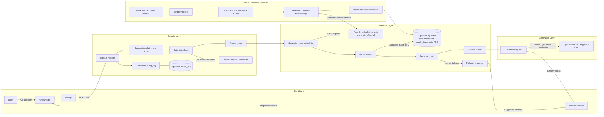
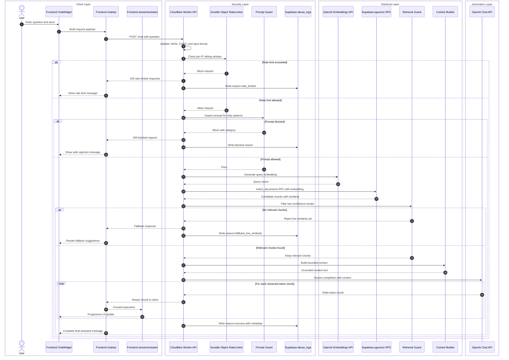

# Portfolio RAG Architecture

This document summarizes the major system components and end-to-end data flow for the portfolio site and chatbot.

## High-Level Components

- Frontend: React SPA with chat UI and streaming renderer.
- API layer: Cloudflare Worker orchestrating validation, security, retrieval, and LLM streaming.
- Vector database: Supabase PostgreSQL with pgvector RPC matching.
- Embedding generation: OpenAI embeddings for both offline documents and live queries.
- LLM interaction: OpenAI chat completion streaming grounded by retrieved context.

## Mermaid Diagram

## Data Flow Summary

1. Ingestion reads markdown/PDF files, chunks content, generates embeddings, and upserts vectors into Supabase.
2. Frontend sends user questions to the Worker API.
3. API validates input, enforces rate limits, and blocks suspicious prompts.
4. API generates query embeddings and retrieves semantically similar chunks from pgvector.
5. Retrieved chunks are filtered and assembled into context.
6. API calls the LLM with grounded context and streams output back to the frontend.
7. Frontend renders streamed tokens in real time.

## Sequence Diagram: Chatbot Query Flow

