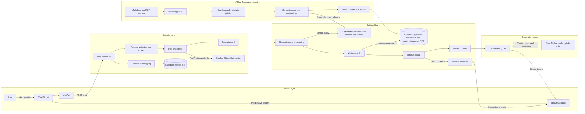
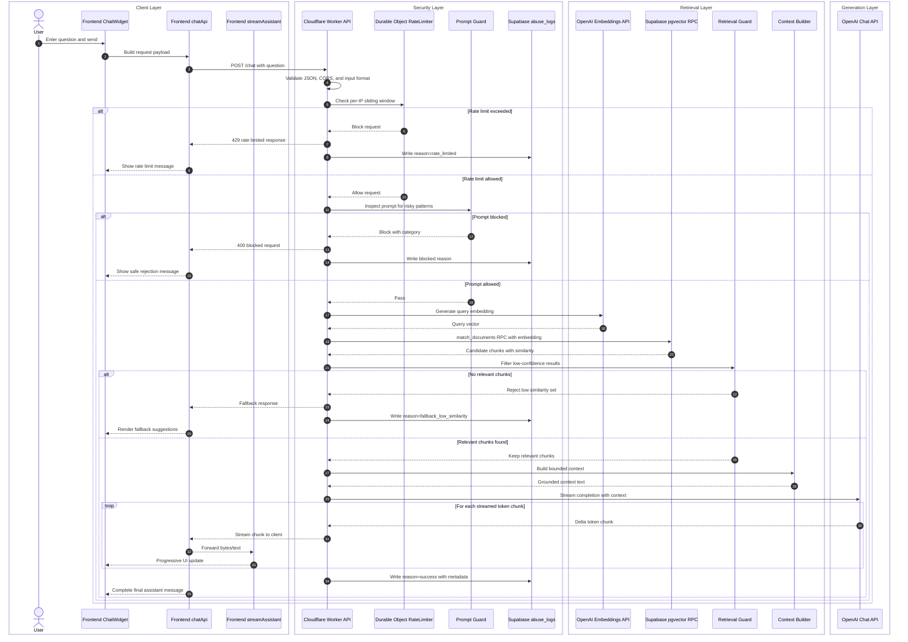
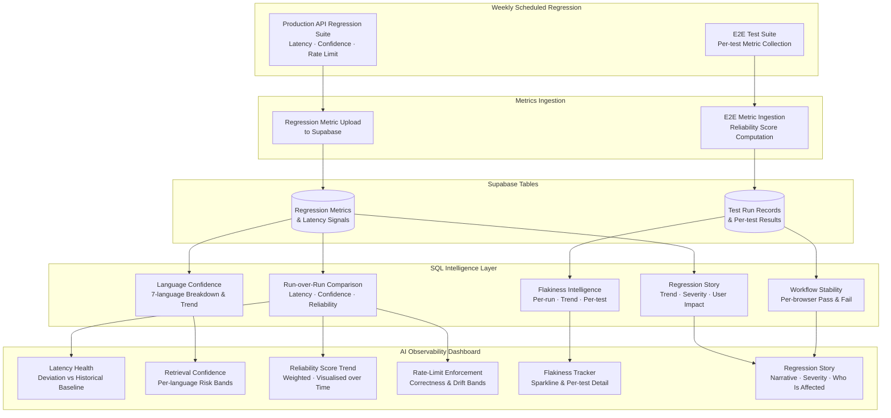

# Portfolio R.A.G. Architecture

This document summarizes the major system components and end-to-end data flow for the portfolio site, chatbot, and AI observability dashboard.

## High-Level Components

- Frontend: React SPA with chat UI, streaming renderer, and live AI observability dashboard.
- API layer: Cloudflare Worker orchestrating validation, security, retrieval, and LLM streaming.
- Vector database: Supabase PostgreSQL with pgvector RPC matching and SQL analytics views.
- Embedding generation: OpenAI embeddings for both offline documents and live queries.
- LLM interaction: OpenAI chat completion streaming grounded by retrieved context.
- Observability: Weekly CI metrics ingested into Supabase, surfaced in a live React dashboard.

## Architecture Diagram

## Data Flow Summary

1. Ingestion reads markdown/PDF files, chunks content, generates embeddings, and upserts vectors into Supabase.
2. Frontend sends user questions to the Worker API.
3. API validates input, enforces rate limits, and blocks suspicious prompts.
4. API generates query embeddings and retrieves semantically similar chunks from pgvector.
5. Retrieved chunks are filtered and assembled into context.
6. API calls the LLM with grounded context and streams output back to the frontend.
7. Frontend renders streamed tokens in real time.
8. Weekly CI regression results are ingested into Supabase and surfaced in the live AI Observability Dashboard.

## Sequence Diagram: Chatbot Query Flow

## AI Observability Dashboard

`src/pages/Dashboard.tsx` is a live React page accessible at `/#/dashboard`. It queries Supabase directly via the REST API and renders real production metrics derived from the weekly regression suite. The dashboard closes the observability loop: CI tests generate data, Supabase stores and analyses it, and the Dashboard surfaces it.

### Dashboard Panels

| Panel | Source View | What It Shows |
|-------|-------------|---------------|
| P95 Latency | `regression_run_comparison` | Current latency vs historical baseline (5 400 ms); deviation classified as Healthy / Degraded / Severe |
| Retrieval Confidence | `retrieval_language_summary` | avg and min confidence per language (EN, ES, FR, DE, PT, ZH, JA); risk bands: Critical <60, Risk 60–75, Healthy ≥75 |
| Reliability Score | `regression_run_comparison` | Pass-rate × 0.7 + flakiness-factor × 0.2 + all-passed bonus × 0.1; baseline 91 |
| Rate-Limit Enforcement | `regression_run_comparison` | Measured block rate vs expected 30.8% (10 req/IP, 13-request probe); drift bands: Healthy / Slight / Degraded / Severe |
| Flakiness Trend | `flakiness_run_summary`, `flakiness_trend` | Current flakiness % + sparkline over last 5 runs; SLA: green <1%, yellow <3%, red ≥3% |
| Regression Story | `regression_story` | Human-readable narrative: trend direction, severity, primary signal, user impact, analysis confidence |
| Test Runs | `e2e_workflow_stability` | Per-workflow pass/fail table with commit SHA and timestamp |
| Flaky Test Detail | `test_flakiness_enriched` | Per-test flakiness %, severity, recency, last seen timestamp |

### Observability Data Pipeline

### SLA Status System

All panels use a four-band status system driven by deviation from historical baselines:

| Status | Color | Meaning |
|--------|-------|---------|
| Healthy | Green | Within expected range or improved |
| Slight degradation | Yellow | Early warning — monitor |
| Degraded | Orange | Meaningful regression — investigate |
| Severe | Red | SLA breach — block release |

Baselines are derived from historical production data and stored as constants in `Dashboard.tsx`:
- P95 latency expected: `5 400 ms`, degraded threshold: `5 800 ms`
- Retrieval confidence expected: `81%`, warn threshold: `75%`
- Reliability score expected: `91`, warn threshold: `88`
- Rate-limit enforcement expected: `30.8%` (±2% green, ±5% yellow, ±10% orange)
