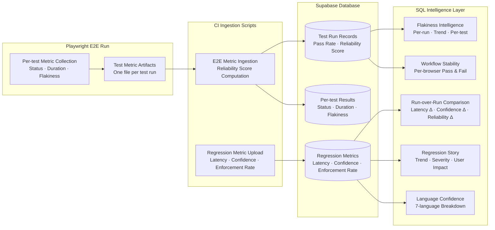
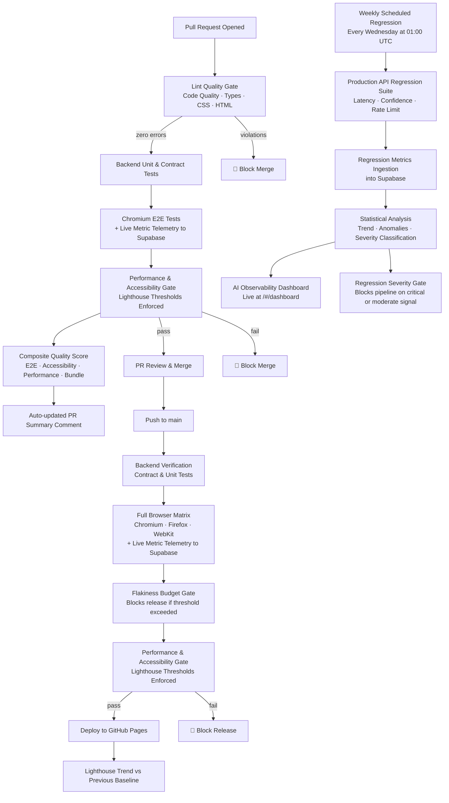

# CI/CD Strategy – Portfolio + RAG Chatbot (Current State)

## 1) Purpose

This document reflects the CI/CD behavior currently implemented in:
- `.github/workflows/lint-quality-gate.yml`
- `.github/workflows/pr-quality-gates.yml`
- `.github/workflows/deploy.yml`
- `.github/workflows/weekly-regression-gates.yml`

Objectives of the current pipeline:
- Block merges/releases on failing quality gates
- Enforce code quality standards (ESLint, TypeScript, Stylelint, HTMLHint) on every PR
- Validate backend and frontend behavior before deployment
- Enforce accessibility/performance budgets with min thresholds via Lighthouse
- Run scheduled regression checks against the production API endpoint
- Ingest test metrics into Supabase for trend analysis and live dashboard rendering
- Preserve execution artifacts that can be reused for PR summaries and debugging

## 2) Workflow Inventory

| Workflow | Trigger | Main Goal |
|---|---|---|
| Lint Quality Gate | `pull_request` to `main`, manual dispatch | ESLint, TypeScript, Stylelint, HTMLHint enforcement |
| PR Quality Gates | `pull_request` to `main`, manual dispatch | Fast feedback for PR safety |
| Deployment Quality Gates | `push` to `main`, manual dispatch | Full verification before GitHub Pages deploy |
| Weekly Regression Suite | Cron (`Wed 01:00 UTC`) & manual dispatch | Production endpoint drift detection + Dashboard data ingestion |

## 3) Lint Quality Gate (Static Analysis Tier)

Defined in `.github/workflows/lint-quality-gate.yml`.

### 3.1 Jobs

1. **lint** (5 min timeout, `MAX_ALLOWED_LINT_ERRORS=0`)
   - Runs ESLint across `.ts`/`.tsx`/`.js` files → `summaries/eslint.txt`
   - Runs TypeScript type-check (`tsc --noEmit`) → `summaries/typecheck.txt`
   - Runs Stylelint across all `**/*.css` files → `summaries/stylelint.txt`
   - Runs HTMLHint across all `**/*.html` files → `summaries/htmlhint.txt`
   - Generates `metrics/lint.json` via `lint-summary.mjs` with error counts and `thresholdPassed` flag
   - Uploads lint summary artifact and publishes to `$GITHUB_STEP_SUMMARY`
   - Fails the job if `thresholdPassed=false` (any lint error detected)

2. **pr-comment** (always, PR only, needs lint)
   - Downloads lint summary and metrics artifacts
   - Finds or creates a PR comment with lint results
   - Comment updates on each push so reviewers always see the latest state

### 3.2 Lint Gate Characteristics
- All four linters run with `continue-on-error` so all results are collected before the gate fires
- Zero-error policy: `MAX_ALLOWED_LINT_ERRORS=0` — any violation blocks the PR
- Enforces: TypeScript correctness, React hooks rules, CSS property validity, HTML attribute validity

## 4) PR Quality Gates (Fast Tier)

Defined in `.github/workflows/pr-quality-gates.yml`.

### 4.1 Jobs

1. **backend** 
   - Installs root + backend dependencies
   - Starts Worker locally (`npm run dev` in `portfolio-chatbot`)
   - Runs backend Vitest suite (`npm test`)

2. **e2e (chromium)** (needs backend to pass)
   - Builds frontend (`npm run build`)
   - Runs Playwright on Chromium only
   - Captures bundle size, accessibility metric (`AXE_CRITICAL_COUNT`), pass/fail, and duration as artifacts
   - Publishes JUnit results to GitHub Checks UI via `dorny/test-reporter`
   - Ingests E2E metrics to Supabase via `ingest-e2e-metrics.mjs`
   - Writes per-run metric files: `bundle.json`, `a11y.json`, `e2e.json`, `duration.json`

3. **lighthouse** (needs `e2e`)
   - Builds frontend
   - Runs Lighthouse CI with `lighthouserc-ci.json`
   - Uploads a Lighthouse summary artifact

4. **quality-score** (always, needs `e2e` + `lighthouse`)
   - Downloads all metric artifacts
   - Computes composite PR quality score via `pr-quality-score.mjs`:
     - E2E pass: +25 pts
     - Accessibility (zero critical violations): +15 pts
     - Lighthouse score: ×0.4
     - Bundle penalty: −5 if >250 KB, −10 if >300 KB
     - Duration bonus: +10 if <300 s, +5 if <420 s
   - Verdict: Excellent (≥85) / Good (70–84) / Needs improvement (50–69) / Poor (<50)

5. **pr-comment** (always, PR only, needs quality-score)
   - Downloads all summaries and metrics
   - Builds comment body from: `quality-score.md`, `chromium.md`, `lighthouse.md`
   - Creates or updates a single bot comment per PR

### 4.2 PR Gate Characteristics
- Linear gate sequence: `backend` → `e2e` → `lighthouse` → `quality-score` → `pr-comment`
- Artifacts retained for debugging and telemetry (`playwright-report`, `test-results`, summaries, metrics)
- Failing checks block PR merge when branch protection requires them

## 5) Main Branch Deployment Gates

Defined in `.github/workflows/deploy.yml`.

### 5.1 Pre-deploy Verification Jobs

1. **backend** 
   - Starts Worker and runs backend tests (`npm run test:ci`)
   - Emits backend summary in job summary

2. **e2e matrix** (needs backend, matrix: chromium | firefox | webkit)
   - Builds frontend
   - Runs Playwright on each browser independently (parallel matrix)
   - Publishes JUnit per browser via `dorny/test-reporter`
   - Writes per-browser summaries to `$GITHUB_STEP_SUMMARY`
   - Uploads flaky metrics and browser-specific failure artifacts
   - Enforces flaky-test budget: job fails if `flaky > 3`
   - Ingests E2E metrics to Supabase via `ingest-e2e-metrics.mjs`

3. **lighthouse** (needs `e2e` matrix)
   - Runs Lighthouse budget/assertion checks
   - Uploads a `lighthouse-score` artifact for later comparison

### 5.2 Deploy Job
- Runs only if `backend`, `e2e`, and `lighthouse` all succeed
- Builds frontend with production env vars (VITE_BASE, VITE_SUPABASE_URL, VITE_SUPABASE_ANON_KEY)
- Downloads the prior `lighthouse-baseline` artifact for trend comparison
- Deploys `dist/` to GitHub Pages via `actions/deploy-pages`
- Computes Lighthouse delta vs previous run and publishes release summary
- Uploads new `lighthouse-baseline` for the next deployment

## 6) Metrics Ingestion Pipeline

After each PR and deployment E2E run, test metrics flow from Playwright artifacts into Supabase:



**Reliability score formula** (computed per run in `ingest-e2e-metrics.mjs`):
```
reliability_score = (pass_rate × 0.7) + ((1 − flaky_rate) × 0.2) + (all_passed ? 0.1 : 0) × 100
```

## 7) Weekly Production Regression

Defined in `.github/workflows/weekly-regression-gates.yml`.

### 7.1 Execution Model
- Runs weekly at `Wed 01:00 UTC` and on manual dispatch
- Validates production endpoint health (`/health`) before tests start
- Runs backend suite in NIGHTLY mode against the deployed API:
  - `NIGHTLY=true`
  - `API_BASE_URL=<production endpoint>`
- Captures latency, confidence, reliability, and enforcement-rate metrics
- Uploads metrics via `scripts/upload-metrics.js` → Supabase regression tables

### 7.2 Regression Gate Evaluation
- Queries `regression_story` view after upload
- If `regression_severity` is `critical` or `moderate`, the job fails
- Infrastructure errors do not fail the pipeline (continue-on-error)
- Failed test events are recorded to `failure_events` table for trend correlation

### 7.3 Output and Reporting
- Publishes JUnit via `dorny/test-reporter` → visible in GitHub Checks UI
- Uploads regression artifacts on failure (`junit.xml`, `playwright-report`, `test-results`)
- Queries 30+ Supabase view columns for structured dashboard variables
- Populates Supabase regression tables that power the **live AI Observability Dashboard** at `/#/dashboard`

## 8) Quality Gates Currently Enforced

### 8.1 Code Quality (Lint Gate)
- ESLint: zero violations (React hooks, TypeScript rules, React refresh)
- TypeScript: zero type errors (`tsc --noEmit`)
- Stylelint: zero CSS property violations
- HTMLHint: zero HTML attribute violations

### 8.2 Backend
- API contract stability checks
- Prompt-guard logic checks
- Context builder checks
- Weekly scheduled retrieval/performance/rate-limit regression checks

### 8.3 Frontend
- Smoke/navigation/chat interaction checks (Chromium on PR, full matrix on deploy)
- Accessibility critical-issue gate (`axe-core` in Playwright)
- AI Dashboard navigation check (`/#/dashboard` URL routing)

### 8.4 Performance and Accessibility
Lighthouse assertions from `lighthouserc.json`:
- Performance: min `0.70` (error)
- Accessibility: min `0.90` (error)
- Best Practices: min `0.85` (error)
- SEO: min `0.85` (warn)

## 9) Artifact and Feedback Model

Current pipeline feedback channels:
- GitHub Checks (JUnit reports per browser)
- Uploaded artifacts (Playwright report, traces, test results, metrics)
- Workflow/job summaries (`$GITHUB_STEP_SUMMARY`)
- Auto-updated PR result comment (lint + E2E + Lighthouse + quality score)
- Release summary with Lighthouse delta vs previous baseline
- Supabase analytics views → Live AI Observability Dashboard at `/#/dashboard`

## 10) Pipeline Overview


