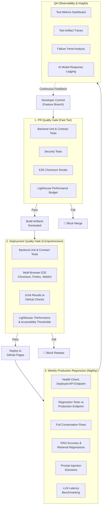
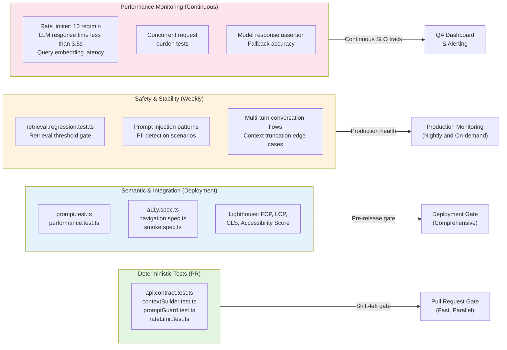

# QA Automation Strategy – Multi-Layer Quality Gates

## Overview
This document outlines a comprehensive quality gates strategy that evolves QA automation from traditional testing (unit, contract, E2E, accessibility) into AI-era assurance. By layering deterministic assertions, semantic validations, security evaluations, and performance monitoring across PR, deployment, and production stages, we ensure that AI-driven chatbot responses are trustworthy, secure, and performant.

The strategy demonstrates how QA automation engineers can shift left on AI assurance: embedding security checks at the edge, validating retrieval confidence before LLM calls, monitoring latency regressions, and catching prompt injection attempts before they reach the model.

## Quality Gates Strategy

## Test Type Mapping: Deterministic → Semantic → Safety → Performance

## Test Artifact Inventory

| Category | Test Files | Purpose | Frequency |
|----------|-----------|---------|----------|
| **Backend Unit** | `api.contract.test.ts`, `contextBuilder.test.ts`, `promptGuard.test.ts`, `rateLimit.test.ts` | API contract validation, guard logic, rate limiter sliding window | PR + Deploy |
| **Backend Regression** | `retrieval.regression.test.ts`, `performance.test.ts`, `prompt.test.ts` | RAG accuracy, LLM latency, prompt handling | Weekly (production endpoint) |
| **Frontend E2E** | `a11y.spec.ts`, `navigation.spec.ts`, `smoke.spec.ts` | Accessibility, page navigation, critical user paths | Deployment (multi-browser) + Weekly (chromium) |
| **Security Scenarios** | Prompt injection tests, PII detection, SSRF/SQL injection patterns, XSS payloads | Input validation, guard effectiveness, abuse detection | PR (fast checks) + Weekly (full suite) |
| **Performance Gates** | Lighthouse budget, LLM response time thresholds, rate limit enforcement | Web performance, Core Web Vitals, accessibility score, LLM latency SLO | All stages |

## Why This Approach Matters For AI Assurance

1. **Shift-Left Security**: Prompt guards run in CI/CD *before* deployment, catching injection attempts in PR reviews.
2. **Semantic Validation**: Rather than just API status codes, we assert *meaningful* retrieval hits and context relevance.
3. **Observable Regressions**: Failure logs are tied to abuse_logs and conversation traces, enabling post-incident analysis.
4. **AI-Specific Metrics**: We track LLM latency, fallback rates, and retrieval confidence—traditional QA metrics don't apply.
5. **Production Health First**: Weekly regression tests hit the deployed endpoint, not mocks, catching real-world degradation.