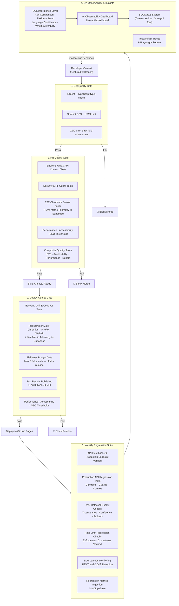

# QA Automation Strategy – Multi-Layer Quality Gates

## Overview
This document outlines a comprehensive quality gates strategy that evolves QA automation from traditional testing (unit, contract, E2E, accessibility) into AI-era assurance. By layering deterministic assertions, semantic validations, security evaluations, and performance monitoring across PR, deployment, and production stages, we ensure that AI-driven chatbot responses are trustworthy, secure, and performant.

The strategy demonstrates how QA automation engineers can shift left on AI assurance: embedding security checks at the edge, validating retrieval confidence before LLM calls, monitoring latency regressions, and catching prompt injection attempts before they reach the model. 

A live AI Observability Dashboard closes the feedback loop surfacing production health metrics in real time so teams can act on data, not intuition.

## Quality Gates Strategy

## Test Artifact Inventory

| Category | Test Files | Purpose | Frequency |
|----------|-----------|---------|----------|
| **Backend PR/Deploy Core** | `api.contract.test.ts`, `contextBuilder.test.ts`, `promptGuard.test.ts`, `prompt.test.ts` | API contract validation, prompt safety checks, context builder behavior | PR + Deploy |
| **Backend Weekly Regression** | `retrieval.regression.test.ts`, `performance.test.ts`, `rateLimit.test.ts` | Retrieval grounding drift (7 languages), latency stability, rate-limit enforcement on deployed API | Weekly (production endpoint) |
| **Frontend E2E** | `a11y.spec.ts`, `navigation.spec.ts`, `smoke.spec.ts` | Accessibility, navigation, critical UX + chatbot mocked interaction, AI Dashboard routing | PR (chromium) + Deploy (chromium/firefox/webkit) |
| **Security Scenarios** | Prompt injection, PII detection, SQL/XSS/encoded payload patterns | Input validation and guard effectiveness at request layer | PR + Deploy |
| **Performance Gates** | Lighthouse assertions, weekly scheduled latency checks, rate limit regression | Web vitals/accessibility budgets + backend latency guardrails | Deploy + Weekly |
| **Observability** | `Dashboard.tsx` live Supabase queries | Real-time production health, latency, confidence, reliability, flakiness | Continuous (post-weekly ingestion) |

## Live Observability Dashboard

`src/pages/Dashboard.tsx` is a full React page accessible at `/#/dashboard`. It queries Supabase REST API directly and renders production metrics in real time after each weekly regression run.

### Dashboard Panels

| Panel | Supabase View | Metric | SLA Thresholds |
|-------|--------------|--------|----------------|
| **P95 Latency** | `regression_run_comparison` | Latency deviation vs 5 400 ms baseline | ≤0%: Green, ≤9%: Yellow, ≤15%: Orange, >15%: Red |
| **Retrieval Confidence** | `retrieval_language_summary` | avg/min confidence per language (EN, ES, FR, DE, PT, ZH, JA) | ≥75%: Green, 60–75%: Yellow, <60%: Red |
| **Reliability Score** | `regression_run_comparison` | Weighted pass-rate score vs 91 baseline | ≥90: Green, ≥85: Yellow, <85: Red |
| **Rate-Limit Enforcement** | `regression_run_comparison` | Block rate vs expected 30.8% | ±2%: Green, ±5%: Yellow, ±10%: Orange, >10%: Red |
| **Flakiness Trend** | `flakiness_run_summary` + `flakiness_trend` | Current flakiness % + 5-run sparkline | <1%: Green, <3%: Yellow, ≥3%: Red |
| **Regression Story** | `regression_story` | Narrative: trend direction, severity, primary signal, user impact | Severity badge: stable / moderate / critical |
| **Test Run Table** | `e2e_workflow_stability` | Per-workflow pass/fail with commit SHA | — |
| **Flaky Test Detail** | `test_flakiness_enriched` | Per-test flakiness %, severity, last seen | Severity: high / medium / low |

### Visualisation Technology
- **Recharts** `LineChart` with `ReferenceArea` and `ReferenceLine` for SLA band overlays
- **Intersection Observer** (`LazyViewport`) for deferred chart rendering, keeps initial load fast
- **Scroll-to-top** button with scroll position detection
- **SLA badge system**: green / yellow / orange / red driven purely by deviation from historical constants

## Why This Approach Matters For AI Assurance

1. **Shift-Left Security**: Prompt guards run in CI/CD *before* deployment, catching injection attempts in PR reviews.
2. **Semantic Validation**: Rather than just API status codes, we assert *meaningful* retrieval hits and context relevance across 7 languages.
3. **Observable Regressions**: Failure logs are tied to abuse_logs and conversation traces, enabling post-incident analysis.
4. **AI-Specific Metrics**: We track LLM latency, fallback rates, and retrieval confidence, traditional QA metrics don't apply.
5. **Production Health First**: Weekly regression tests hit the deployed endpoint, not mocks, catching real-world degradation.
6. **Closed Feedback Loop**: The live Dashboard surfaces production signals back to the team without requiring manual report generation, data flows automatically from CI through Supabase into the UI.
