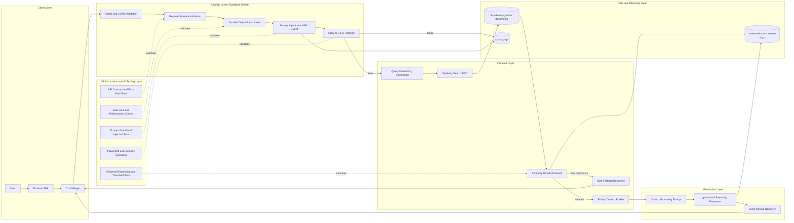

# AI Chatbot Security Architecture

## Description
This architecture demonstrates a defense-in-depth approach for a production-style RAG chatbot, combining edge protection, prompt safety, retrieval trust checks, and observable AI behavior. It is designed to show how QA automation engineering evolves into AI assurance by validating not only UI and API correctness, but also security and trustworthiness of model-driven flows.

## Objective
Showcase a practical security testing mindset for AI systems: prevent abusive input, constrain untrusted retrieval, reduce hallucination risk, and provide auditable signals that can be continuously validated through automated tests.

## Security Layers Diagram

## Why This Matters For QA Automation In AI

- Security is testable: each guardrail is mapped to an automatable checkpoint.
- AI quality is measurable: retrieval confidence and fallback behavior are asserted, not assumed.
- Risk is observable: abuse and conversation logs provide auditable evidence for incident triage.
- Shift-left AI assurance: security, reliability, and model-behavior checks are embedded into CI test strategy.