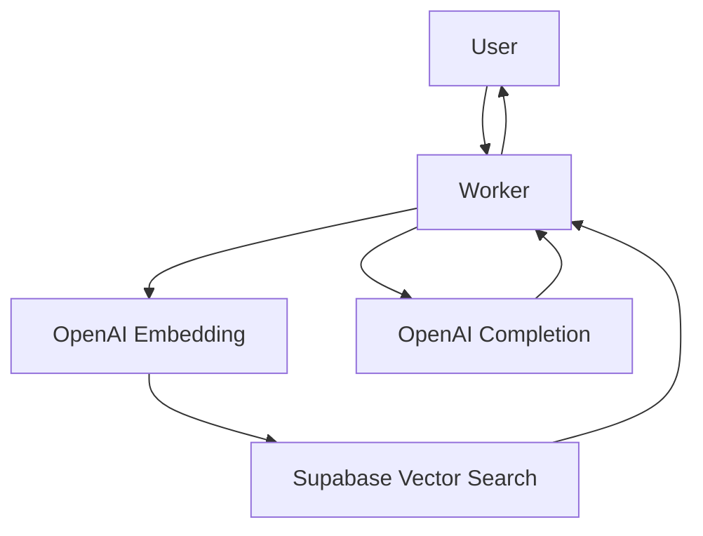

# Portfolio Chatbot

This folder contains the **portfolio-chatbot** feature, which integrates RGA and LLM through a database API, with full CI/CD automation.

## Overview

The chatbot leverages:
- **RGA (Retrieval-Augmented Generation)** for enhanced context-aware responses
- **LLM (Large Language Model)** via API for intelligent conversation
- **Supabase** for vector search and storage
- **Cloudflare Worker** for scalable serverless execution
- **Automated CI/CD** for reliable deployments and testing

## Architecture



## Features

- **Contextual chat** powered by RGA and LLM
- **Vector search** for document retrieval
- **Serverless deployment** (Cloudflare Worker)
- **Automated testing and CI/CD**

## Folder Structure

- `data/` — PDFs and readmes for ingestion
- `scripts/` — Data ingestion scripts
- `src/` — Chatbot source code
- `worker-configuration.d.ts` — Worker configuration types
- `wrangler.jsonc` — Cloudflare Worker config

## Setup

1. Install dependencies:
   ```bash
   npm install
   ```
2. Configure environment variables as needed (see `wrangler.jsonc`).
3. Run ingestion scripts:
   ```bash
   npm run ingest
   ```
4. Deploy to Cloudflare:
   ```bash
   npm run deploy
   ```

## CI/CD

- Automated tests and deployment via GitHub Actions
- Linting, build, and integration checks

## Usage

Interact with the chatbot via the deployed endpoint. Supports document retrieval and intelligent Q&A.

---

For more details, see the main [README.md](../README.md).